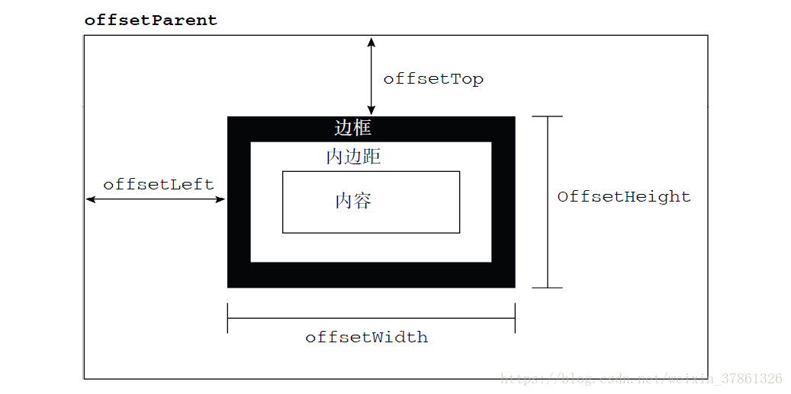
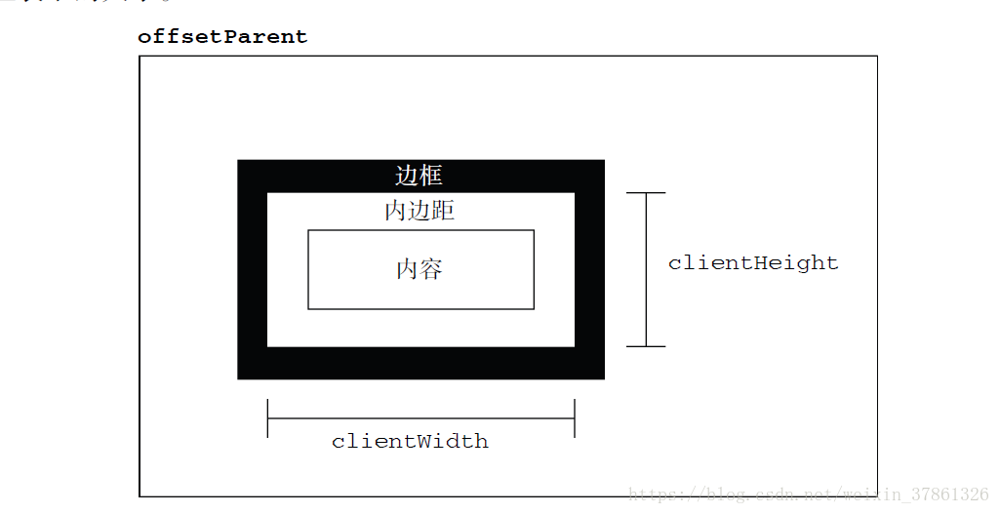
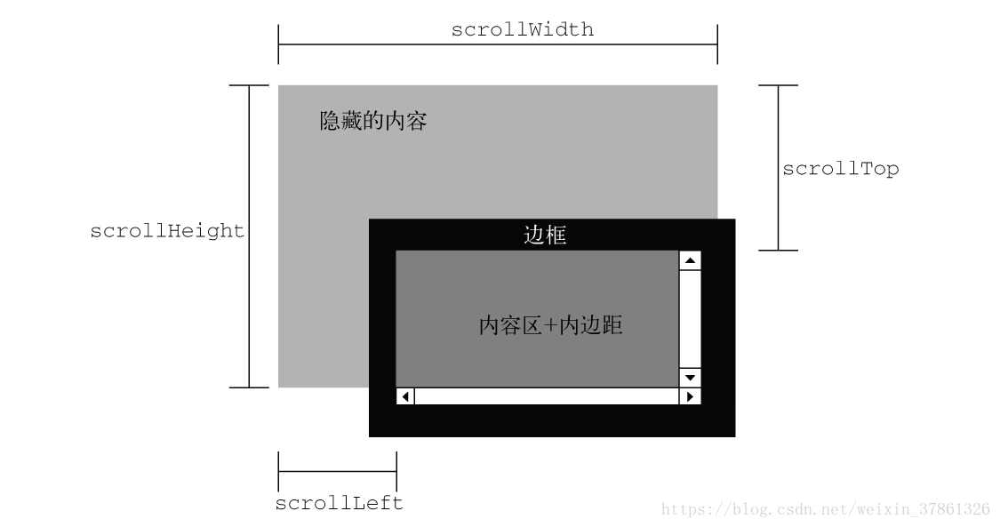

一、Web浏览器中的js（客户端js）
  1. 客户端js时间线
  2. 标准模式和怪异模式
  3. 同源策略和不严格的同源策略
  4. 书签
  5. 跨站脚本，xss攻击

二、window对象
  1. location对象, window.location === document.location
    (1) doucment.url
    (2) URL分解属性——hash、search、host等，同时被<a>和<area>支持
        可写，赋值会载入新文档或跳转位置
    (3) 方法——载入新文档assign()、replace()和重载当前文档reload()
  2. history对象
    子窗口iframe的浏览历史会按时间顺序安插在主窗口的历史中
  3. navigator对象--浏览器信息
    userAgent
  4. screen对象
    (1) width, height
    availWidth, availHeight

    

    (2) document.body和document.documentElement
        offset, client, scroll width和height
        

          
          
          
        

  5. onerror错误事件处理
  6. 多窗口和窗体
    (1) open(), close()
    (2) 访问窗体属性parent, self

三、document文档操作
  1. 选取文档元素

二. html5 API
  1. postMessage(message, url)
    message为基本类型值或者可以结构性复制的对象
    url会自动忽略除协议、域名、端口之外的信息

参考链接
1. HTML 获取屏幕、浏览器、页面的高度宽度 https://www.cnblogs.com/polk6/p/5051935.html
2. js中offset、client、scroll的区别 https://blog.csdn.net/weixin_37861326/article/details/81453593
