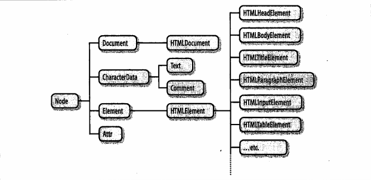

一、Web浏览器中的js（客户端js）
  1. 客户端js时间线
  2. 标准模式和怪异模式
  3. 同源策略和不严格的同源策略
  4. 书签
  5. 跨站脚本，xss攻击

二、window对象
  1. location对象, window.location === document.location
    (1) doucment.url
    (2) URL分解属性——hash、search、host等，同时被<a>和<area>支持
        可写，赋值会载入新文档或跳转位置
    (3) 方法——载入新文档assign()、replace()和重载当前文档reload()
  2. history对象
    子窗口iframe的浏览历史会按时间顺序安插在主窗口的历史中
  3. navigator对象--浏览器信息
    userAgent
  4. screen对象 
    (1) width, height
    availWidth, availHeight

    

    (2) document.body和document.documentElement
        offset, client, scroll width和height
        

          
          
          
        

  5. onerror错误事件处理
  6. 多窗口和窗体 
    (1) open(), close()
    
    (2) 访问窗体属性parent, self

三、document文档操作
  1. 选取文档元素
    document.getElementBy..., document.querySelector...
  2. 文档遍历
    (1) DOM节点种类
      
    (2) 作为节点树--包含Document、Element、Text、Comment等节点
      parentNode
      childNodes
      firstChild, lastChild
      nextSibling, previoursSibling
      nodeType: Document-9, Element-1, Text-3, Comment-8, DocumentFragment-11
      nodeValue: Text节点或Comment节点的文本内容, 可读写
      nodeName: 大写形式的标签名
    (3) 作为元素树--只包含element节点
      children
      firstElementChild, lastElementChild
      nextElementSibling, previousElementSibling
      childElementCount
    (4) ELement节点的属性
      setAttribute, getAttribute, 或者直接通过键值获取(如img.id)
      hasAttribute, removeAttribute
      数据集属性, element.dataset.x或者通过getAttribute获取
    (5) 元素内容
      innerHTML和outerHTML
      element.textContent和element.innerText, textContent属性是把所有后代Text节点简单串联在一起
      Text和Comment节点的nodeValue属性
    (6) 创建、插入、删除节点
      createElement, createTextNode, createDocumentFragment
      appendChild, insertBefore
      removeChile, replaceChild
    (7) 
    

二. html5 API
  1. postMessage(message, url)
    message为基本类型值或者可以结构性复制的对象
    url会自动忽略除协议、域名、端口之外的信息

参考链接
1. HTML 获取屏幕、浏览器、页面的高度宽度 https://www.cnblogs.com/polk6/p/5051935.html
2. js中offset、client、scroll的区别 https://blog.csdn.net/weixin_37861326/article/details/81453593
